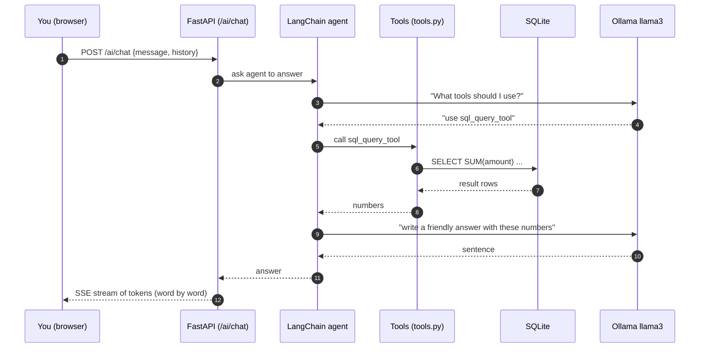
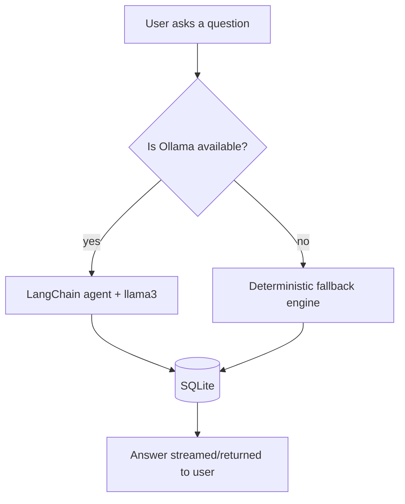

# How the AI Assistant Works (for AI beginners)

This guide explains the AI part of the app in plain language. You do **not** need any prior AI
knowledge. By the end you will understand: what a Large Language Model (LLM) is, what Ollama and
LangChain do, how the app answers questions, and what happens when no LLM is available.

---

## 1. What is a Large Language Model (LLM)?

A **Large Language Model** (LLM) is a computer program trained on a huge amount of text. Given
some text, it predicts what text comes next. ChatGPT and Llama are examples of LLMs.

- The **model itself** is just the "thinking" brain: it converts your words into a reply.
- **Llama 3** is an open-source model made by Meta. We use it because it runs **locally** on
  your computer (no cloud, no API fees, and your data stays private).

## 2. What is Ollama?

**Ollama** is a simple program that lets you download and run LLMs on your own machine:

```bash
# install
curl -fsSL https://ollama.com/install.sh | sh

# download the llama3 model
ollama pull llama3

# quick test
ollama run llama3 "hello"
```

Ollama runs a small HTTP server on `http://localhost:11434`. Our backend connects to it.

## 3. What is LangChain?

**LangChain** is a Python library that helps LLMs do practical things — in our case, *read a
database*. On its own, an LLM can only write text; it cannot query SQLite. LangChain gives the
LLM **tools** to call, and decides which tool to use.

Our tools live in `server/app/ai/tools.py`:

| Tool                      | What it does                                      |
|---------------------------|---------------------------------------------------|
| `sql_query_tool`          | Runs read-only SQL against SQLite and returns rows |
| `financial_insights`      | Computes totals, category analysis, pending payments, savings hints |
| `generate_monthly_summary`| Writes a natural-language monthly summary         |
| `generate_pdf_ready_text` | Produces text blocks ready for the PDF            |

This pattern — "give an LLM tools, let it decide" — is called a **tool-using agent**.

## 4. Putting it together: how a chat message works

When you type *"How much did I spend this month?"* in the AI Chat page:



Notice the loop: **model → tool → model**. The LLM does not compute anything itself; it asks a
tool for the numbers, then writes them up nicely.

## 5. Memory: why the assistant remembers the conversation

The chat keeps a short memory so the assistant can follow along. `agent.py` uses
`ConversationBufferMemory(memory_key="chat_history")`. Every message you send includes the recent
history, so the model knows what was already said.

## 6. Streaming: why the answer appears word by word

`POST /ai/chat` returns a **Server-Sent Events (SSE)** stream. Instead of waiting for the whole
answer, the backend sends each token as it is produced. The frontend (`ChatUI.tsx`) reads these
frames and updates the message bubble in real time — this is why the text "types" itself out.

Each streamed frame looks like:

```text
data: {"token": "You"}

data: {"token": " spent"}

data: {"token": " ₹"}
```

## 7. Fallback mode: what happens without an LLM

Ollama may not be installed, or the model may be missing. In that case the app **must still
work**. `agent.is_available` is `False`, and the agent switches to a **deterministic fallback
engine**.

The fallback engine does not "think" — it uses simple rules:

- It looks at the message text and **matches keywords** ("spend", "servant", "milk", "invest", ...).
- It runs the same database queries as the tools would.
- It assembles a pre-written sentence with the real numbers.

So both paths — real LLM and fallback — produce an answer from the same data, and **every
feature keeps working** even with no AI installed. The UI shows a small chip so you know which
engine answered.

Investment questions ("Suggest investments for ₹1,00,000") are handled by the fallback's
`_investment_answer`, which reuses the same catalog and allocation logic as the
`POST /investments/advisor` endpoint.



## 8. Where the AI endpoints live

| Endpoint                   | What it returns                                    | Streaming? |
|----------------------------|----------------------------------------------------|------------|
| `POST /ai/chat`            | natural-language answer to a question              | yes (SSE)  |
| `GET /ai/insights`         | insights text + structured data                    | no         |
| `GET /ai/report/monthly`   | AI-written monthly summary text                    | no         |

These are implemented in `server/app/routers/ai.py`, using the agent in `server/app/ai/agent.py`.

## 9. Try it

1. Run the app (see the [README](../README.md#run-it-yourself)).
2. Log in with `admin` / `admin123`.
3. Open **AI Chat** and ask:
   - "Which servant salary is pending?"
   - "What is my top spending category this month?"
   - "Generate a monthly report for 2026-08."

If you have Ollama installed the answers come from Llama 3; otherwise the fallback engine
answers with the same numbers.

## 10. Glossary

| Term              | Meaning |
|-------------------|---------|
| LLM              | Large Language Model — a text-generating AI |
| Token            | a chunk of text the model reads/writes (roughly part of a word) |
| Agent            | an LLM that can call tools to do tasks |
| Tool             | a function the agent can call (e.g. run SQL) |
| SSE / Streaming  | sending the answer gradually instead of all at once |
| Fallback engine  | a rule-based answerer used when no LLM is available |
