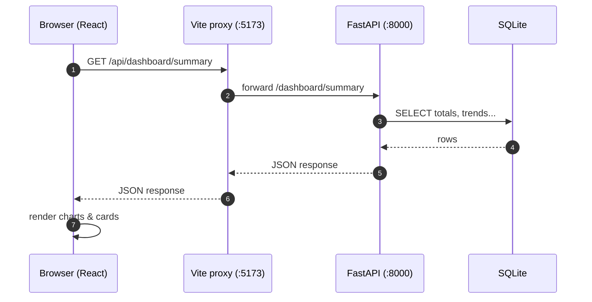
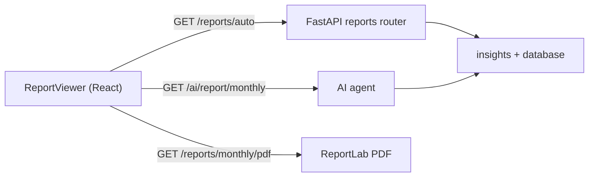

# Architecture Guide (for AI beginners)

This guide explains **how the application is put together** in plain language. It assumes you
are new to full-stack development or AI. After reading, you should be able to explain the app's
architecture to someone else.

> Tip: if you want to run the app first and "feel" the architecture, see the
> [README](../README.md#run-it-yourself), then come back here.

---

## 1. The big picture: three layers

Every web application has three layers that talk to each other:

```
┌─────────────────────────────┐
│  1. FRONTEND  (browser)     │  What the user sees and clicks
│     React + Material UI     │  Runs in the user's browser
└──────────────┬──────────────┘
               │  HTTP requests (/api/...)
               ▼
┌─────────────────────────────┐
│  2. BACKEND   (Python)      │  The "brain" that does the work
│     FastAPI                 │  Runs on a server
└──────────────┬──────────────┘
               │  SQL queries
               ▼
┌─────────────────────────────┐
│  3. DATABASE  (SQLite)      │  Where data is saved
│     one file: household.db  │  A single file on disk
└─────────────────────────────┘
```

- **Frontend** asks the backend for data (e.g. "give me this month's expenses").
- **Backend** reads/writes the database and answers.
- **Frontend** displays the answer.

In this project there is a fourth, optional piece — the **AI assistant** — which we explain in
[docs/AI_GUIDE.md](docs/AI_GUIDE.md).

## 2. Where each piece lives in the code

```
server/                       <- BACKEND (Python)
  app/main.py                 <- entry point: creates the FastAPI app
  app/models/                 <- database tables (what we store)
  app/routers/                <- API endpoints (what we can ask the backend)
  app/services/insights.py    <- financial math (totals, pending, trends)
  app/ai/                     <- the AI assistant

frontend/                     <- FRONTEND (TypeScript)
  src/pages/                  <- one file per screen (Dashboard, Expenses, ...)
  src/components/             <- reusable building blocks (forms, tables, charts)
  src/api/client.ts           <- how the frontend calls the backend
```

### 2.1 The request lifecycle (normal page load)

When you open the **Dashboard**, this is what happens under the hood:

1. **React renders the page** (`frontend/src/pages/DashboardPage.tsx`).
2. On load it calls `api.get('/dashboard/summary')` (`src/api/client.ts`).
3. **Vite dev server** proxies that `/api/dashboard/summary` request to the backend at
   `http://localhost:8000` (`frontend/vite.config.ts`). This is why there are no CORS errors.
4. **FastAPI** matches the URL to the router `GET /dashboard/summary`
   (`server/app/routers/dashboard.py`).
5. The router asks `services/insights.py` to compute totals from the database.
6. FastAPI returns JSON.
7. React stores it and **renders the charts** (`DashboardCharts.tsx`).

A diagram of this flow:



## 3. The database (what we store)

The database is **SQLite** — a single file at `server/data/household.db`. It is created and
filled with sample data automatically when the backend starts.

Five tables are defined in `server/app/models/`:

| Table                   | What it stores                         |
|-------------------------|----------------------------------------|
| `users`                 | login accounts (username, hashed password, role) |
| `expenses`              | everyday spending (category, amount, date)      |
| `servants`              | household staff (name, role, monthly salary)    |
| `milk_deliveries`       | milk purchases (supplier, quantity, rate)       |
| `newspaper_deliveries`  | newspaper subscriptions (name, monthly cost)    |
| `investments`           | investments (scheme, category, amount, expected return) |

A nice picture of the relationships is in [docs/DIAGRAMS.md](docs/DIAGRAMS.md#2-entity-relationship-er-diagram).

## 4. Authentication (who are you?)

Most endpoints require a login. The app uses **JWT** (JSON Web Token):

1. You log in with `admin` / `admin123` (`POST /auth/login`).
2. The backend checks the password, then issues a **signed token**.
3. The frontend stores the token and sends it with every request
   (`Authorization: Bearer <token>`).
4. `server/app/auth/dependencies.py` verifies the token on protected endpoints.

JWT is a common, industry-standard way to authenticate APIs. It is like a digital name badge
that expires.

## 5. REST endpoints: what the frontend can ask for

Each router in `server/app/routers/` owns one "resource":

| Router     | Base path       | Things you can do                    |
|------------|-----------------|--------------------------------------|
| `auth.py`  | `/auth`         | register, login, get my profile      |
| `expenses.py` | `/expenses`   | create, list, update, delete, bulk-delete |
| `servants.py` | `/servants`  | same for servants                    |
| `milk.py`  | `/milk`         | same for milk deliveries             |
| `newspaper.py` | `/newspaper` | same for newspapers                |
| `investments.py` | `/investments` | same for investments + catalog, advisor, summary |
| `dashboard.py` | `/dashboard` | summary numbers and charts data    |
| `ai.py`    | `/ai`           | chat, insights, monthly report       |
| `reports.py` | `/reports`    | auto-report + PDF download           |
| `diagrams.py` | `/diagrams`  | ASCII/SVG diagrams (scripting only)  |

> The "bulk-delete" endpoints let the UI delete several records at once, or everything.
> They accept `{"ids": [1,2,3]}` or `{"all": true}`.

## 6. Frontend structure: how screens are built

Each page in `frontend/src/pages/` has three friends:

- **A form component** to add/edit an item (e.g. `ExpenseForm.tsx`).
- **A list component** to show items with **sorting, filtering, and bulk delete**
  (e.g. `ExpenseList.tsx`).
- **Shared table controls** (`components/TableControls.tsx` + `utils/useTableControls.ts`)
  that power the click-to-sort headers and per-column filter boxes on every list page.

State like "is the user logged in?" lives in **Zustand stores** (`src/store/`), so any
component can read it without passing props down many levels.

## 7. Reports pipeline

When you click **Generate** on the Reports page (`ReportViewer.tsx`), two things happen in
parallel:

1. `GET /reports/auto?month=YYYY-MM` returns a **structured report**: totals, category
   breakdown, pending payments, and an AI-written summary.
2. `GET /ai/report/monthly?month=YYYY-MM` returns just the AI summary text.

When you click **Download PDF**, the backend (`server/app/reports/pdf.py`) builds a
**ReportLab PDF** containing tables, charts and the AI text, and streams it to the browser.



## 8. Environment & configuration

The backend reads settings from environment variables in `server/app/config.py`:

| Variable          | Default               | Purpose                     |
|-------------------|-----------------------|-----------------------------|
| `DATABASE_URL`    | `sqlite:///data/household.db` | where to store data   |
| `OLLAMA_BASE_URL` | `http://localhost:11434` | local LLM server       |
| `OLLAMA_MODEL`    | `llama3`              | which model to use          |
| `JWT_SECRET`      | auto-generated        | signs login tokens          |

## 9. Common questions

**Q: Why is there a Vite proxy?**
So the frontend (`:5173`) and backend (`:8000`) can be reached through **one port** — perfect
for a single-port preview environment — and to avoid CORS issues during development.

**Q: Why SQLite instead of PostgreSQL/MySQL?**
SQLite is a single file, needs no server, and is perfect for a household-scale app. It is the
simplest way to get started and can be swapped later.

**Q: Where is the AI?**
The AI lives on the backend in `server/app/ai/`. It is optional: without it the app falls back
to a deterministic engine. See [docs/AI_GUIDE.md](docs/AI_GUIDE.md).

**Q: How do I add a new expense category?**
`category` is a free-text field everywhere. Add the new name to the suggestion list in
`frontend/src/types/index.ts` (`expenseCategories`) so it appears in the dropdown — no backend
change needed.
