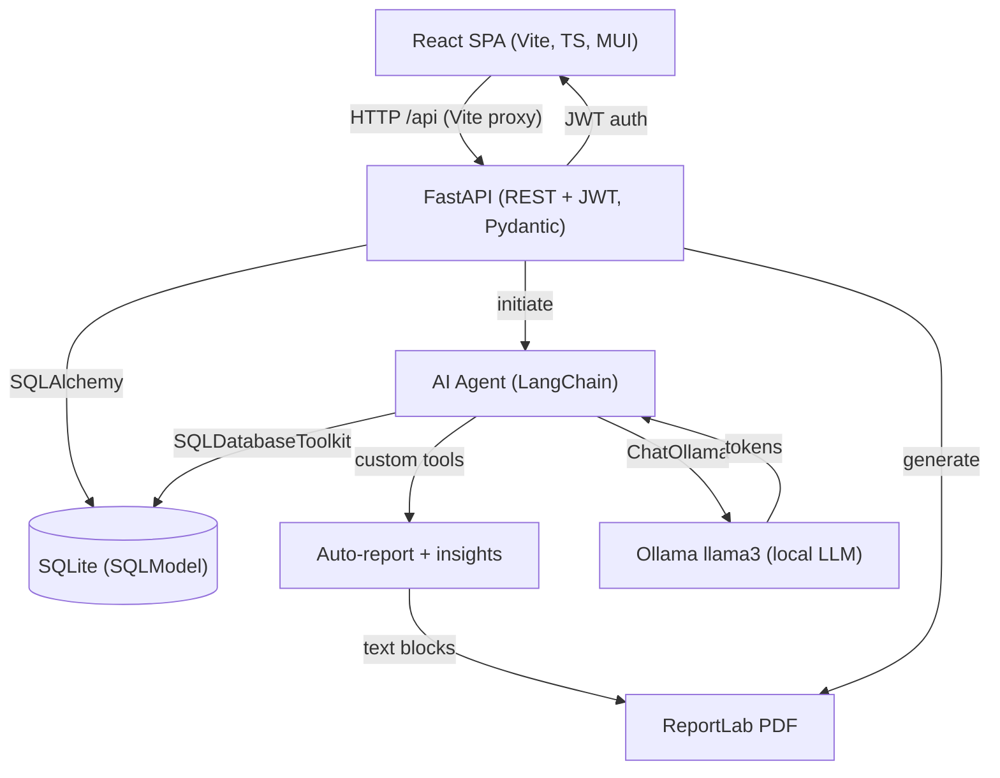
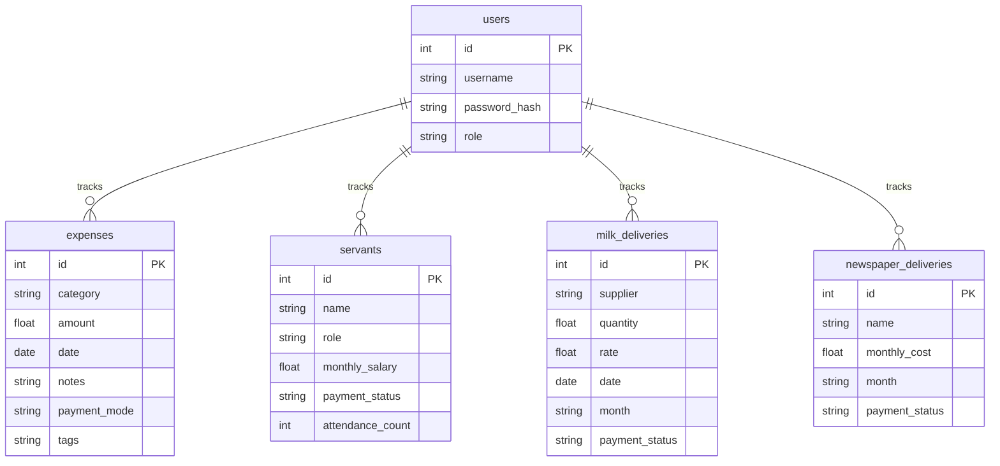
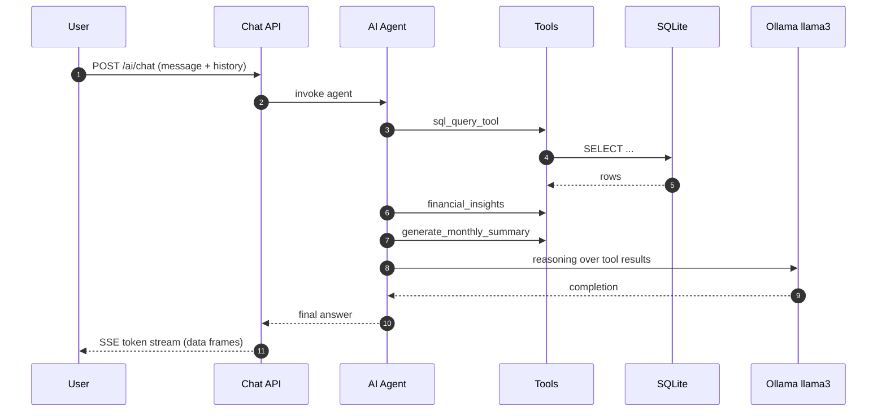

# System Diagrams

The diagrams for this application are documented here as Mermaid diagrams so they can be
rendered directly by GitHub, GitLab, VS Code, or any Mermaid-compatible viewer. There is no
diagram page in the UI; use the code below as living documentation.

## 1. Architecture

## 2. Entity Relationship (ER) Diagram

Notes:

- Months are stored as `YYYY-MM` strings and indexed.
- `payment_status` is one of `pending` | `paid`.
- The relationships shown are logical ownership (application-level); the SQLite schema
  itself has no foreign keys.

## 3. AI Agent Workflow

## Fallback behaviour

If Ollama is not running, the agent executes in **fallback mode**: the same tools and database
queries are driven by a deterministic keyword router, so chat, insights, auto-reports and the
monthly PDF all keep working without an LLM.
